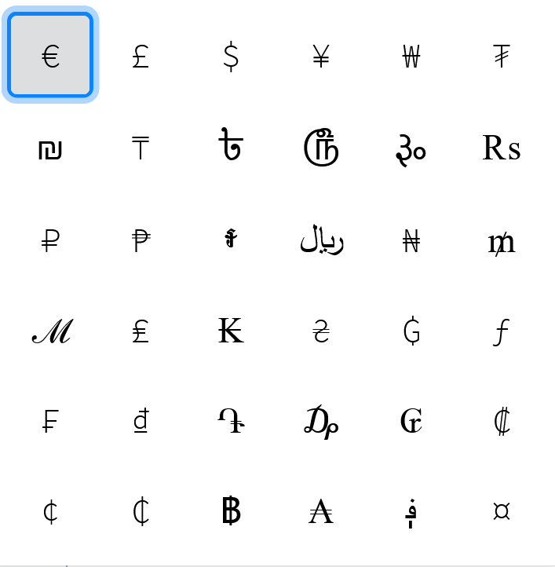

# All currencies
This extension permits you to copy a currency symbol in the clipboard.
It is published on Firefox Addons https://addons.mozilla.org/it/firefox/addon//.

## How to contribute
You can open an issue and there you must describe the feedback, the bug or the new feature you want.

## Screenshots

Add-ons UI:

